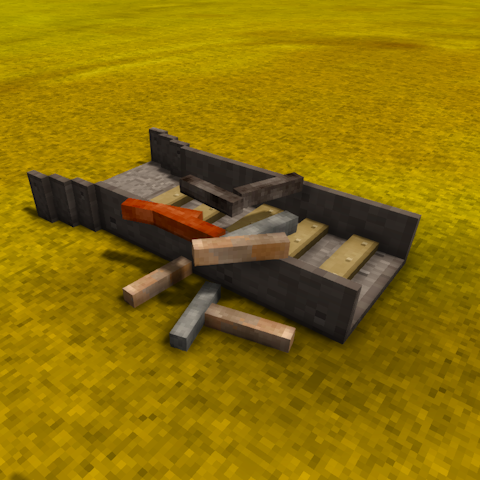

# Sluice: Circuit's Patch

A Vintage Story mod that patches the "Sluice" mod to allow crafting the sluice with any combination of metal rods.

## Description

This mod requires "Sluice" and patches the crafting recipe from "rod-iron" to "rod-*".

### About "Sluice" (Original Mod)

The "Sluice" mod allows you to craft a sluice block that automates the panning of sand, gravel, and boney soil. Originally, this mod only allows you to craft the block with 3 iron rods. 

## Features

- **Simpler Crafting**: The only change made is to the crafting recipe, allowing any combination of 3 metal rods to be used.

## Screenshots

## Installation

1. Download the mod file
2. Place it in your Vintage Story `Mods` folder
3. Ensure you have the "Sluice" mod installed (required dependency)
4. Launch Vintage Story

## Requirements

- **Vintage Story 1.20.12-1.12.1** (or compatible version)
- **Sluice 1.2.0 or 2.2.0** (required dependency)

## Author

**CircuitPwne**

## Repository

[GitHub Repository](https://github.com/CircuitDev192/SluiceCircuitsPatch)

## Version

1.0.0

## License

GNU GPL v3
